# DIAGRAMAS
1 . [Casos de Uso](#id1)
- 1.1  [Casos de uso: Registro de cuenta](#id2)
- 1.2  [Casos de uso: Inicio de Sesión](#id3)
- 1.3 [Casos de uso: Gestión de Usuarios](#id4)
- 1.4 [Casos de uso: Muestra de Productos](#id5)
- 1.5 [Casos de uso: Venta de Productos](#id6)

2 . [Diagrama Modelo Entidad-Relación](#id7)

3 . [Diagrama de Clases](#id8)

4 . [Diagrama ER](#id9)

# CASOS DE USO 
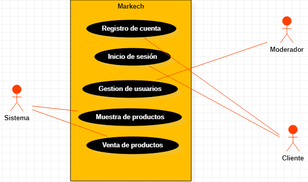
## Caso de uso: Registro de Cuenta 
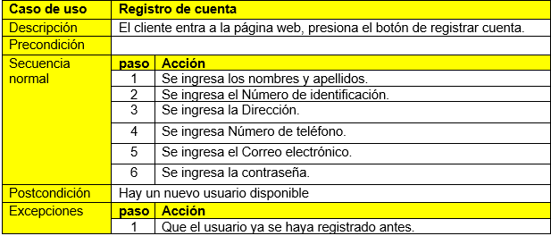
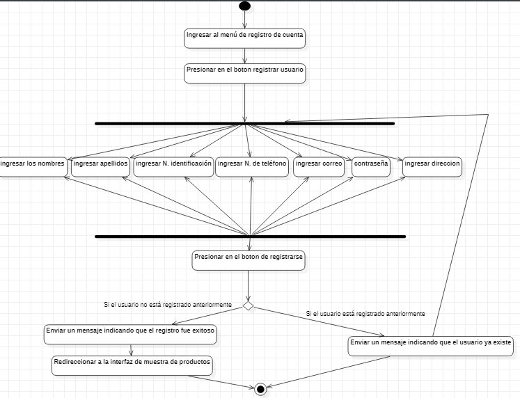
## Caso de uso: Inicio de Sesión 
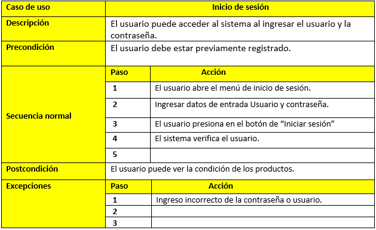

## Caso de uso: Gestión de Usuarios 
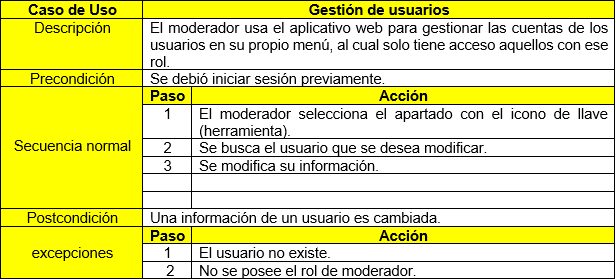
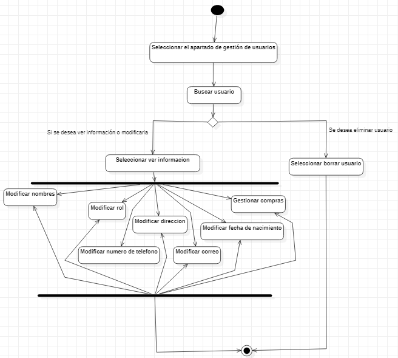
## Caso de uso: Muestra de Productos 
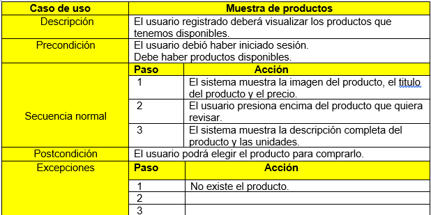
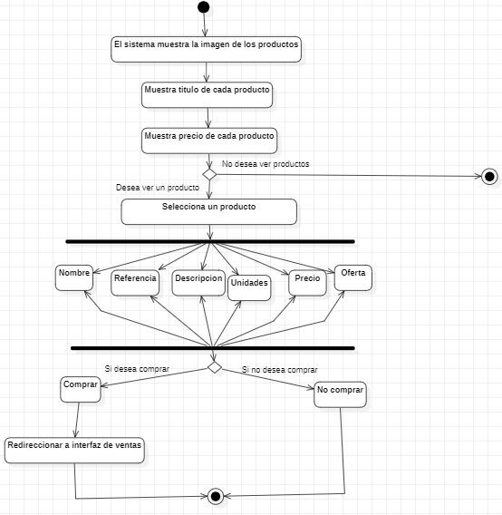
## Caso de uso: Venta de Productos 
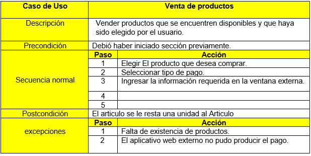
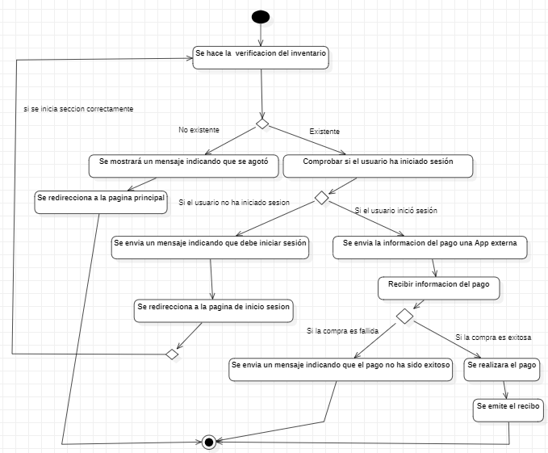
# DIAGRAMA MODELO ENTIDAD-RELACION             
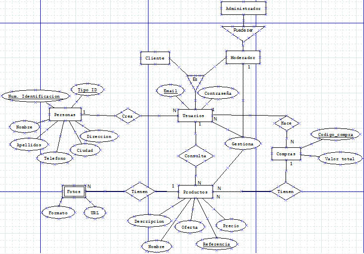
# DIAGRAMA DE CLASES 
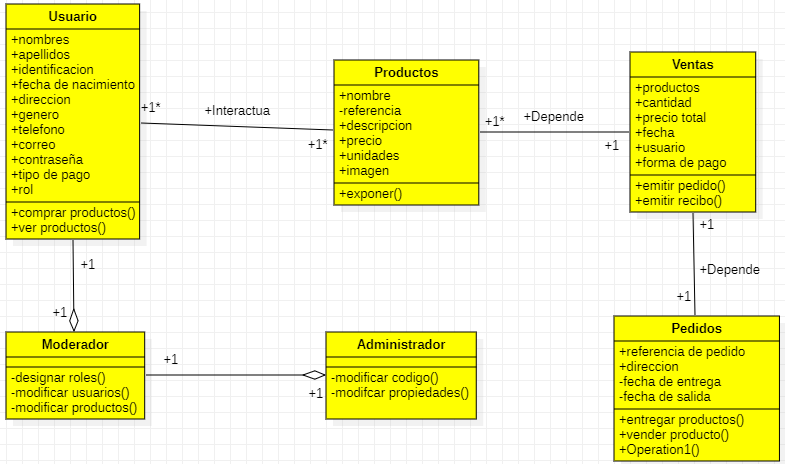
# DIAGRAMA ER 
